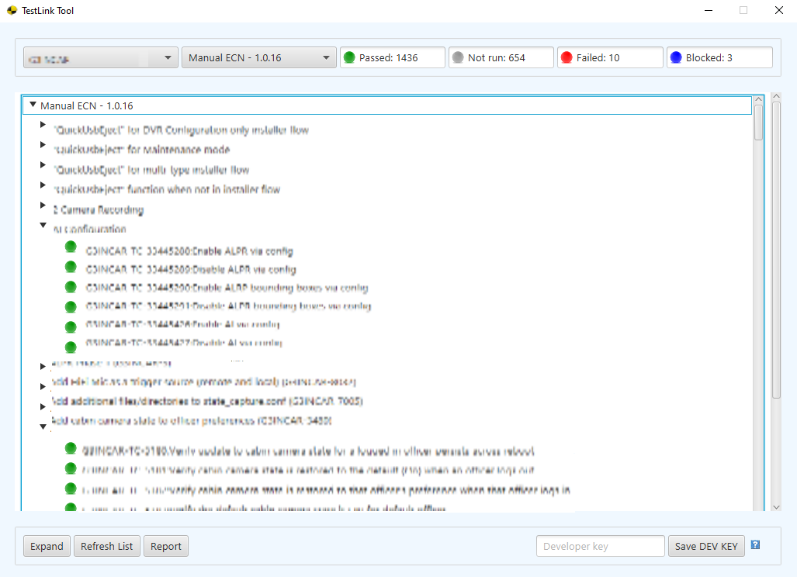
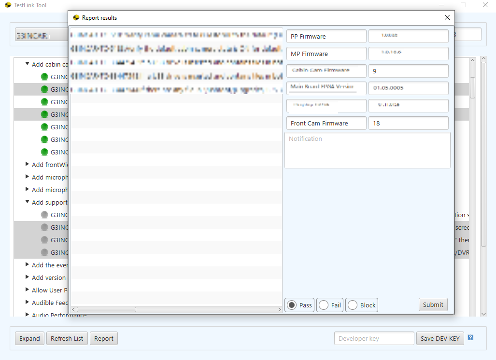

# TestLinkTool
The application created in order to help run the test smoothly and reliably

## Purpose and HowTo

The application is a helper tool and represents the test run with the statuses. 
To use that you will need 
* link to your TestLink server
* developer key
* custom fields will need to be modified by the needs of the product

First screen represents the Main window where you may observe the state of the run and 
pick necessary tests for further reporting

Second screen represents the Report popup window. Fill the custom fields once 
and they will be saved in testlink-config.json file. Report multiple test cases instantly
